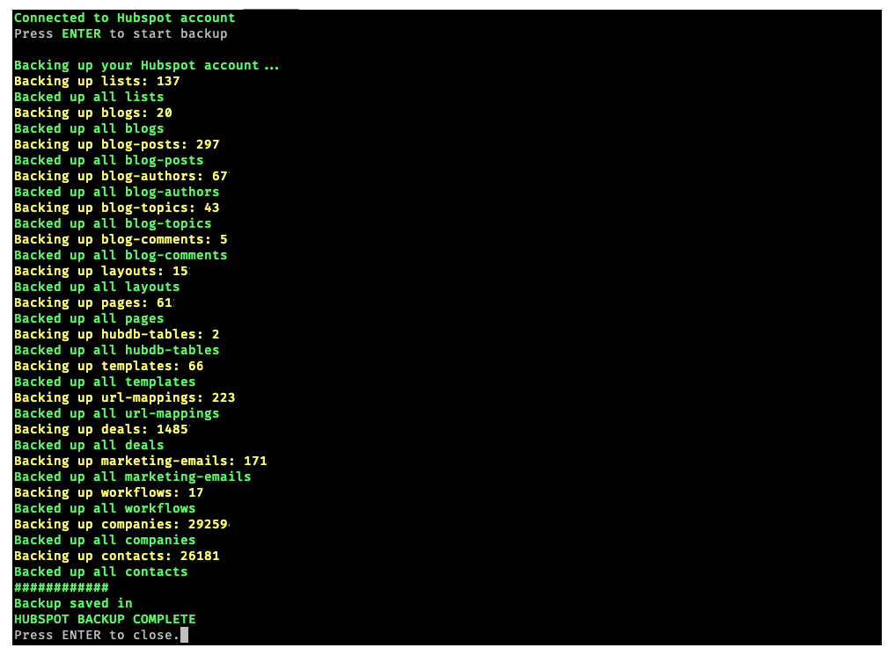

# Hubspot Data & Content Backup

Quickly backup everything from your Hubspot account to hard drive for free

## Desktop CLI app to backup your Hubspot account.

- for Windows, Mac and Linux
- no SaaS: download once, own forever
- no cloud - files are yours
- no middlemen - connects directly from your computer to your Hubspot account
- straighforward and easy to use text interface

## Backs up:
  - contacts
  - companies
  - deals
  - contact lists
  - blogs
  - blogposts (without images)
  - blog authors
  - blog topics
  - blog comments
  - website & landing pages
  - layouts
  - HubDB tables
  - templates
  - URL mappings
  - marketing emails
  - workflows

## What does it do

Queries multiple Hubspot API endpoints and downloads raw responses as JSON files, where filename is object id. Files will be created in `hubspot-backup` folder.

**This is not a full backup solution**. I would suggest treating it more like a last resort backup when everything else failed to restore data. Restoring data requires developer's help and some custom scripts to upload files back to Hubspot.

## Authentication

Hubspot API key is required for this app to work. You need to create private Hubspot app and generate new access token:  [https://developers.hubspot.com/docs/guides/apps/private-apps/overview](https://developers.hubspot.com/docs/guides/apps/private-apps/overview).

The app will check for token in this order:

1. `hapikey` CLI argument
2. `HAPIKEY` environment variable
3. `stdin`, after asking the user to provide token

## Download

Compiled binaries are available on [releases page](https://github.com/patrykkalinowski/go-hubspot-backup/releases).

## Build from source

### Windows

GOOS=windows GOARCH=386 go build -o dist/go-hubspot-backup.exe main.go

### Linux

GOOS=linux go build -o dist/go-hubspot-backup main.go

### Mac

GOOS=darwin go build -o dist/go-hubspot-backup.command main.go

Mac build is not signed and needs to have execute permissions assigned, see <https://support.apple.com/en-gb/guide/mac-help/mh40616/mac>
